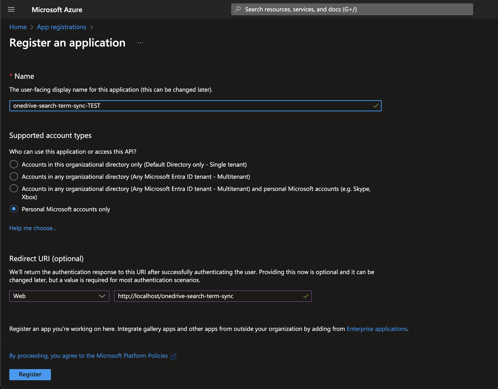
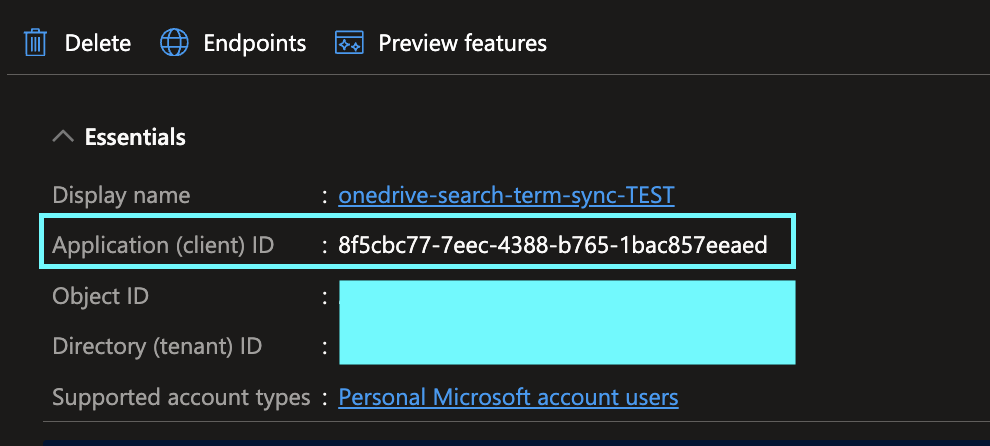
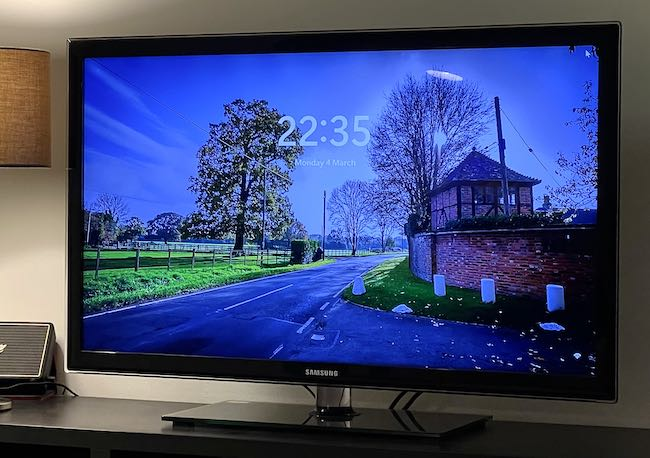

# onedrive-search-term-sync
Powershell script to copy files from OneDrive which match a specified search term

## Overview
This script allows you to synchronize files in Microsoft OneDrive that match a user-specified search term with a local folder on your PC.

The general usage would be as follows:

* Specify a local folder e.g. `C:\Users\MyName\OneDriveSync\Cat Pictures` which will receive the files from OneDrive
* Specify a search term which matches all the files you wish to sync e.g. `cats`
* Register a client app instance and client secret in the Azure Portal to allow the script to utilise the OneDrive API
* Add the client app ID and secret to the config file for this script
* Run the script to query the API with the search term
* All files matching the search term `cats` are downloaded to the local folder, preserving the OneDrive file path structure
* Running the script again e.g. on a schedule results in local files being updated to continually match the search results

## Setup

### 1. Create an client application so the script can connect to the OneDrive API
You first need to register a client application on the Azure Portal to be able to access your OneDrive over API. A summary of the required steps is below or [click here to read Microsoft's detailed documentation](https://learn.microsoft.com/en-us/entra/identity-platform/quickstart-register-app).

* Navigate to [https://portal.azure.com/#view/Microsoft_AAD_RegisteredApps/ApplicationsListBlade](https://portal.azure.com/#view/Microsoft_AAD_RegisteredApps/ApplicationsListBlade)
* Click **+ New Registration**
* Name your application e.g. `onedrive-search-term-sync`
* Under "Who can use this application..." select **Personal Microsoft Accounts only** for a personal OneDrive instance
* Under "Redirect URI" select **Web** and enter `http://localhost/onedrive-search-term-sync`
    * 📝 Note that this callback URI is [hard-coded](./modules/GetAuthToken.psm1#L51) into the script so if you use your own, authentication will not work unless you also change the script. It does not matter if the URI does not return any response.
* Click **Register**



* Copy the `Application (client) ID` to be used in the `config.xml` file (see below)



* Click **Certificates & secrets**
* Click **New client secret**, select a name and expiry date
* Copy the `Value` of the secret key into the `config.xml` file

### 2. Download this repository locally
Download this entire repository using `git clone` or by download the source code from GitHub/Bitbucket. You should place the code into a folder on your computer e.g. `C:\Users\MyName\Scripts\onedrive-search-term-sync`

### 3. Create a config.xml file

You must create a file called `config.xml` with a root element `<config>` and the following four nodes: 

| Node (Variable) | Description                                                                                                  |
|-----------------|--------------------------------------------------------------------------------------------------------------|
| syncRoot        | The full path to the folder which you wish to use to receive the files from OneDrive. See WARNING below.     |
| clientId        | The ID of the client application you set up above to allow the script to authenticate with the OneDrive API. |
| clientSecret    | The secret key for the client application used by the script to authenticate with the OneDrive API.          |
| searchTerm      | Your search term. The script will search your OneDrive for files matching this term.                         |

It is recommended to copy the example file in this repository `config.example.xml` as your starting point.

⚠️ **WARNING: The script has the ability to DELETE files in the syncRoot folder. Make sure this is a dedicated folder to receive OneDrive files related to your search term. Any files and subfolders of the sync root folder which are not downloaded from OneDrive are [deleted](./modules/SyncODSearchResults.psm1#L53) when the script is run.**

### 4. Run the script for the first time

```
> cd "path\to\script"
> powershell .\sync.ps1
```

This step will:
* Ask if you would like to create the sync root folder specified in the `config.xml` file, unless it already exists.
* Download a dependency (the OneDrive module) from the Powershell Gallery, if it is not already installed on your machine.
* Pop up an OAuth2 dialog window to authenticate your Microsoft account as the owner of the client application which is allowed to access your OneDrive using the OneDrive API.
* Attempt to execute the search and download the resulting files. You will get a stream of output indicating which files are being downloaded.

📝 _Note: Ensure your system is set up to allow Powershell scripts to run. Advice can be found online e.g. [this document](https://learn.microsoft.com/en-us/powershell/module/microsoft.powershell.core/about/about_execution_policies)._

---

## Application Details

### My Use Case


I wrote this script as I wanted to sync specific photos from my personal OneDrive to a local folder on my media center PC so that I could use the images as lock screen wallpapers, turning my TV into a digital photo frame.

I did not want _all_ my photos to be available on the TV, only my favourite ones, and I wanted to be able to easily add/remove photos over time.

Furthermore, I didn't want the media center PC to synchronise all OneDrive files and the OneDrive app only allows selective synchronization of entire folders, which was not granular enough for what I wanted.

To "select" a photo I simply tag it in OneDrive with a search term which is unlikely to match any unwanted files. E.g. `lockscreensync`. The OneDrive search considers tags on image files, so returns any photos I have selected when I specify that within this script's config file.

You can read more detail about how I configured the PC to display the photos and regularly sync the files. Just visit [my blog](https://www.andrewchart.co.uk/blog/web/development/display-onedrive-photos-on-windows-lock-screen) for a full writeup.

### File/Folder Structure
_The following describes the folder structure of this application:_

    .
    ├── modules                # Powershell modules imported by the main script
    ├── screenshots            # Images to supplement this README
    ├── .gitignore
    ├── config.example.xml     # Example of a valid configuration file
    ├── LICENSE
    ├── README.md
    └── sync.ps1               # Script entry point


### Limitations

#### Does not sync directories matching the search term
I opted _not_ to sync files from directories which are returned in the search results. It was not necessary for my use case, and would have required recursion into potentially-large directories. If you'd like to change this for your own needs, [this is where the directories are omitted from the results](./modules/SyncODSearchResults.psm1#L22).

#### OneDrive search capabilities and number of results are limited
Whilst the OneDrive search will search meta data like tags, as well as item names, it is otherwise a [basic text search](https://learn.microsoft.com/en-us/onedrive/developer/rest-api/api/driveitem_search). From experimenting `AND` and `NOT` (a.k.a. `-`) seem to have meaning, but other common operators and wildcards do not.

As well as this it is not guaranteed that the API will return _all_ matching results and [this knowledgebase article](https://learn.microsoft.com/en-us/graph/api/resources/search-api-overview?view=graph-rest-1.0#page-search-results) suggests total results will be capped at 1000.

#### Only compatible with Windows
Originally I intended to write the script in such a way that it would work on any platform. However, I also chose to use the [OneDrive Powershell Gallery module](https://www.powershellgallery.com/packages/OneDrive/2.0.0) to shortcut the core OneDrive API functions. This module, in order to present an OAuth login form to users, uses a system library `System.Windows.Forms` to pop up the OAuth dialog in a web browser. 

Unfortunately this meant that the script wouldn't run on my Mac and I wasn't ultimately able to get it running. No OAuth dialog means no authentication, so I was unsuccessful at getting the script to work on a platform other than Windows.

#### Only tested with a personal OneDrive instance
The OneDrive module supports connecting to a business OneDrive / Sharepoint instance, so I have no reason to believe this couldn't work, but the script would need to be modified to additionally supply a ResourceID during the authentication flow.

#### One way synchronization
This script hasn't been designed to do two-way synchronization with OneDrive. OneDrive is the source and the machine running the script is the destination. Files put into the sync root folder at the destination will _not_ be uploaded to OneDrive and furthermore will be **DELETED** as part of the script's cleanup activities.

---

## Notes & Acknowledgements
I was delighted to find the very comprehensive [OneDrive module](https://github.com/MarcelMeurer/PowerShellGallery-OneDrive) by Marcel Meurer on the Powershell gallery. This allowed me to bypass many lines of boilerplate and greatly simplified the script. Thank you, Marcel!
